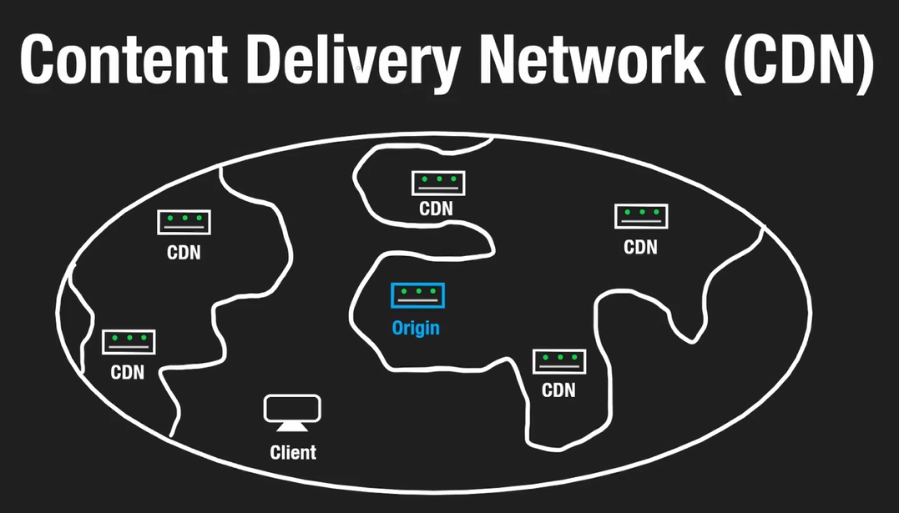
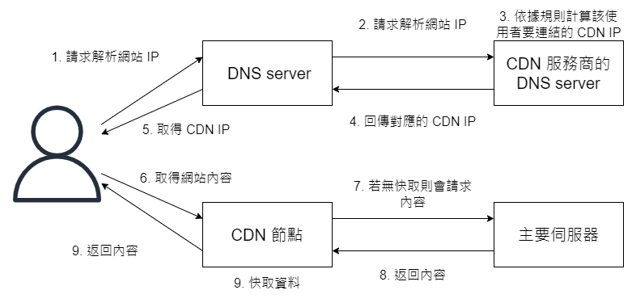

## Content Delivery Network



一般來說，我們的軟體會部屬在網路中的某個節點(IP 位置)上，
所有指向這個系統的請求都會在經過多次路由後被導向這個節點。
如果這時候我們可以在多個位置部屬這個系統，那麼我們就可以減少每個系統的併發量，
也可以讓使用者向最近的節點發送請求，減少網路延遲，這就是 CDN 的基本原理。

但是在上述的情況中，因為我們必須同時維護多個不同位置的系統，這會帶來很高的維護成本，
所以在實際情況中，我們通常只會將靜態的資源部屬在 CDN 上，
像是圖片、影片、CSS、Javascript、HTML 等等。

## CDN 的基本原理

客戶端在請求資源時的目標位置會是 origin server，因此要如何將請求分散到不同的 CDN 伺服器上是一個問題。

這個過程我們可以透過 DNS 來實現，
DNS 可以被看作是一種保存域名和對應的 IP 位置的資料庫，
而域名解析就是在這個資料庫中將域名轉換成 IP 位置的過程。

在 DNS 中有幾種常見的記錄類型：

- A 記錄：將域名轉換成 IPv4 位置
- CNAME 記錄：將域名轉換成另一個域名
- MX 記錄：將域名轉換成郵件伺服器的位置
- NS 記錄：指定域名伺服器的位置
- TXT 記錄：用來存放任意的文字資訊

在 Windows 中，我們可以使用 `nslookup` 來查詢 DNS 記錄：

```bash
nslookup -type=CNAME www.google.com
```

其中 CDN 就是利用了 CNAME 記錄的特性來實現的，
我們需要將一個域名解析成多個 IP 位置，這樣就可以實現將請求分散到不同的伺服器上。
在一般情況下，我們需要將 CNAME 指定到一個服務商提供的域名上，
這樣解析的工作就會交給 CDN 的服務商所提供的 DNS 伺服器來處理，
而這些服務商就會依據依據請求的 IP 位置等等的資訊回傳最適合的 CDN 伺服器的 IP 位置，
這樣就可以實現將請求分散到不同的伺服器上。



## Reference

- [DNS 查詢過程](https://emmielin.medium.com/dns-%E6%9F%A5%E8%A9%A2%E6%B5%81%E7%A8%8B%E6%A6%82%E5%BF%B5%E7%AD%86%E8%A8%98-3a420460d396)
- [CDN 介紹](https://www.cloudflare.com/zh-tw/learning/cdn/what-is-a-cdn/)
