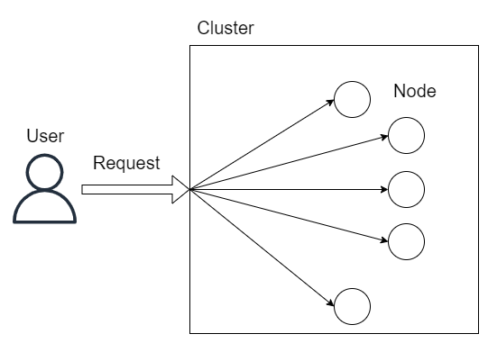

在請求到達系統前，我們可以透過分流設計將使用者的請求進行分流，
而當請求到達系統時，我們可以透過服務平行設計來將請求分發到系統內不同的節點上。

## 叢集系統

叢集系統是實現系統內分流的一種最簡單的方法，
在叢集系統中，我們可以部署多個同質 (同樣的設定與程式) 的節點來共同對外提供服務，
並透過反向代理的方式將請求分發到不同的節點上。

這樣的叢集系統可能會帶來一些問題，其中最明顯的就是會打破服務的連貫性。
假設使用者同時發送了兩個請求，而這兩個請求被分發到了不同的節點上，
且這兩個請求之間有依賴關係，就有可能導致系統的錯誤。

為了解決這個問題，所以有了以下幾種解決方案：

- **無狀態節點叢集**:  
  我們可以將系統拆分成多個無狀態的服務，
  這樣就可以保證每個請求都是獨立的，不會相互影響，
  但是由於無法保存狀態，所以使用情況非常受限。

- **單一服務節點叢集**:  
  我們可以讓使用者的請求總是落在與之對應的節點上，
  讓該節點負責處理該使用者的上下文資訊，
  常見方法如讓使用者自行決定節點 (遊戲伺服器)、依據網路分配節點、或是在登入時將分配結果寫入 cookie 等等。

- **資訊共用節點叢集**:  
  除了上面提到的方法外，我們還可以將狀態保存在共享的資料庫中，
  這樣對於使用者來說，無論請求落在哪個節點上都可以獲得相同的結果，
  除此之外我們也可以使用分散式鎖來解決節點之間的競爭問題，
  但是缺點是性能會受到資料庫讀寫性能的影響。

- **資訊一致的節點叢集**:  
  對於資訊共用的節點叢集來說，雖然運算能力被分散到了各個節點中，
  但是儲存以及讀取資料的能力仍然是集中在資料庫中，使得資料庫成為了系統的瓶頸。
  為了解決這個問題，我們可以讓每個節點都擁有自己的資料庫，
  但是我們必須透過一些一致性協議來保證每個節點的資料都是一致的，
  我們可以根據系統的需求來決定使用何種一致性類型，
  常見的有線性一致性、最終一致性、嚴格一致性等等，
  不同的一致性類型會對系統的性能、可用性、一致性等等產生不同的影響。

## 分散式系統

在叢集系統中，我們可以將系統的運算能力分散到多個節點中，
然而在叢集系統中，每個節點都是同質，如果應用程式較為複雜，依然有可能受到硬體的限制。

在程式不斷變得複雜的情況下，
可能會導致業務邏輯複雜、修改困難、測試困難、部署困難等問題，
為了解決這個問題，我們可以將系統拆分成多個不同的子應用，
讓每個子應用單獨負責一部分的業務邏輯，這就是分散式系統。

在實際應用中，我們可以先將大的單體應用拆分為分散式系統，
而當單個子應用的併發數過高時，
再將併發數過高的子應用部屬成叢集系統。

## 微服務系統

在分散式系統中，每個子應用都是為了完成部分的功能，
且子應用和應用存在著嚴格的從屬關係，這有可能會導致性能的浪費，
這相當於我們只提供了套餐供客人選擇，但是客人可能只需要其中的一部分。

為了解決這個問題，我們可以讓每個子應用獨立對外提供服務，
就可以讓客戶自由選擇自己需要的服務，這就是微服務系統。

對於微服務來說，我們只要保持對外的介面不變，就可以隨時更換內部的實現，
這樣就可以讓系統更加靈活，並且可以更好地應對未來的變化。
